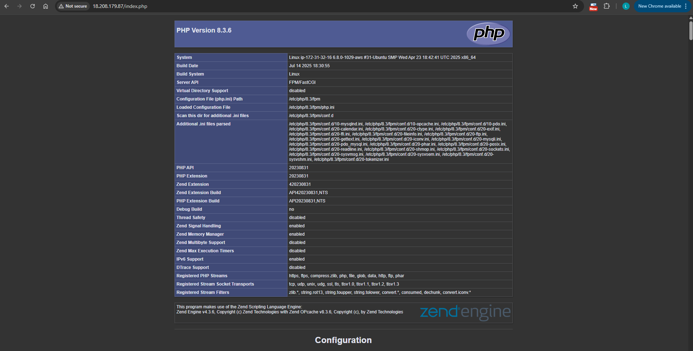

# WEB STACK IMPLEMENTATION (LEMP STACK) IN AWS  

## 📌 Project Overview  
This project demonstrates how to deploy a **LEMP Stack** (Linux, Nginx, MySQL, PHP) on an **AWS EC2 instance**. The goal is to build a working web application environment on the cloud, learn server provisioning, and gain hands-on experience with configuring a full web stack.  

---

## 🛠 Tech Stack  
- **Linux** – Ubuntu 20.04 LTS (Base OS)  
- **Nginx** – Web server  
- **MySQL** – Database  
- **PHP** – Backend scripting  
- **AWS EC2** – Cloud hosting  

---

## 🚀 Project Steps  

### **1️⃣ Launch an EC2 Instance**  
- Log into AWS Console  
- Create an **EC2 instance** running Ubuntu 20.04  
- Configure **Security Groups** to allow HTTP (port 80), and SSH (port 22)

---

### **2️⃣ Install Nginx**  
```bash
sudo apt update
sudo apt install nginx -y
sudo systemctl start nginx
sudo systemctl enable nginx
```
- Access it locally by running `curl http://localhost:80`
- Verified by visiting the public IP of the instance **http://<public address>:80**
- If you don't have your public IP address, you can retrieve it using this command

---

### **3️⃣ Install MySQL**  
```bash
sudo apt install mysql-server -y
```
- After installation is finished, log in to MySQL console by typing
```bash
sudo mysql
```
- It's recommended that you run a security script that comes pre-installed with MySQL. This script will remove some insecure default settings and lock down access to your database system. Before that run a script to set a password for the **root** user using `mysql_native_password`. We are defining this user's password as `PassWord.1`
``SQL
ALTER USER 'root'@'localhost' IDENTIFIED WITH mysql_native_password BY 'PassWord.1';
```
Exit the MySQL shell with:
```SQL
EXIT
```
Start the interactive script by running:
```Bash
sudo mysql_secure_installation
```
After it's done login to MySQL usinb your password `sudo mysql -p`
- Created a test database and user for application connectivity  

---

### **4️⃣ Install PHP**  
- Nginx serves the content, MySQL manages the data, and PHP processes dynamic content. Since Nginx doesn’t embed PHP like Apache, it uses php-fpm (PHP FastCGI Process Manager) to handle PHP requests, and php-mysql to enable PHP-MySQL communication. Core PHP packages are installed automatically as dependencies.
```bash
sudo apt install php-fpm php-mysql -y
```
- Configured PHP processor with Nginx  

---

### **5️⃣ Configure Nginx for PHP**  
When using the Nginx web server, we can create server blocks (similar to virtual hosts in Apache) to encapsulate configuration details and host more than one domain on a single server. In this guide, we will use projectLEMP as an example domain name.

On Ubuntu 20.04, Nginx has one server block enabled by default and is configured to serve documents out of a directory at /var/www/html. While this works well for a single site, it can become difficult to manage if you are hosting multiple sites. Instead of modifying /var/www/html, we'll create a directory structure within /var/www for the your_domain website, leaving /var/www/html in place as the default directory to be served if a client request does not match any other sites.

- Create the root web directory for your_domain as follows: 
```bash
sudo mkdir /var/www/projectLEMP
```
- Next, assign ownership of tghe directory with the `$USER` environment variable, which will reference your current system user
```bash
sudo chown -R $USSER:$USER /var/www/projectLEMP
```
- Open a new configuration file in the Nginx's **sites-available** directory
```bash
sudo vi /etc/nginx/sites-available/projectLEMP
```
This will create a new blank file. Paste in the following bare-bones configuration:
```nginx
#/etc/nginx/sites-available/projectLEMP

server {
    listen 80;
    server_name projectLEMP www.projectLEMP;
    root /var/www/projectLEMP;

    index index.html index.htm index.php;

    location / {
        try_files $uri $uri/ =404;
    }

    location ~ \.php$ {
        include snippets/fastcgi-php.conf;
        fastcgi_pass unix:/var/run/php/php8.3-fpm.sock;
    }

    location ~ /\.ht {
        deny all;
    }
}
```
    Here's what each of these directives and location blocks do:
    - listen: Defines what port Nginx will listen on. In this case, it will listen on port 80, the default port for HTTP.

    - root: Defines the document root where the files served by this website are stored.

    - index: Defines in which order Nginx will prioritize index files for this website. It is a common practice to list index.html files with a higher precedence than index.php files to allow for quickly setting up a maintenance landing page in PHP applications. You can adjust these settings to better suit your application needs.

    - server_name: Defines which domain names and/or IP addresses this server block should respond for. Point this directive to your server's domain name or public IP address.

    - **location** /: The first location block includes a try_files directive, which checks for the existence of files or directories matching a URI request. If Nginx cannot find the appropriate resource, it will return a 404 error.

    - location ~ \.php$: This location block handles the actual PHP processing by pointing Nginx to the fastcgi-php.conf configuration file and the php7.4-fpm.sock file, which declares what socket is associated with php-fpm.

    - location ~ /\.ht: The last location block deals with .htaccess files, which Nginx does not process. By adding the deny all directive, if any .htaccess files happen to find their way into the document root, they will not be served to visitors.
- Activate your configuration by linking it to the config file from Nginx's **sites-enabled**
```
sudo ln -s /etc/nginx/sites-available/projectLEMP /etc/nginx/sites-enabled/
```
- Test your configuration for syntax
```bash
sudo nginx -t
```
- Disable default Nginx host that is currently configured to listen on port 80, for this to run
```bash
sudo unlink /etc/nginx/sites-enabled/default
```
- Restarted Nginx:  
```bash
sudo systemctl restart nginx
```
Your new website is active but the web root **/var/www/projectLEMP** is empty. create an index.html using the command 
```bash
sudo bash -c 'echo "Hello LEMP from $(TOKEN=$(curl -X PUT "http://169.254.169.254/latest/api/token" -H "X-aws-ec2-metadata-token-ttl-seconds: 21600") && curl -H "X-aws-ec2-metadata-token: $TOKEN" -s http://169.254.169.254/latest/meta-data/public-hostname) with public IP $(TOKEN=$(curl -X PUT "http://169.254.169.254/latest/api/token" -H "X-aws-ec2-metadata-token-ttl-seconds: 21600") && curl -H "X-aws-ec2-metadata-token: $TOKEN" -s http://169.254.169.254/latest/meta-data/public-ipv4)" > /var/www/projectLEMP/index.html'

```
- Go to your browser and reload

---

### **6️⃣ Test PHP Setup**  
- Create `info.php` in `/var/www/projectLEMP` with: `sudo vi /var/www/projectLEMP/info.php` paste the script below
```php
<?php
phpinfo();
?>
```
- Verified by visiting `http://<public-ip>/info.php`  
- AFter checking the relevant information about your PHP Server through that page. Remove it for security purpose because it contains sensitive information
```bash
sudo rm /var/www/projectLEMP/info.php
```

---

### **6️⃣ Retrieve data from MySQL database with PHP**  
In this step you will create a test database (DB) with simple "To do list" and configure access to it, so the Nginx website would be able to query data from the DB and display it.
At the time of this writing, the native MySQL PHP library mysqlnd doesn't support caching_sha2_authentication, the default authentication method for MySQL 8. We'll need to create a new user with the mysql_native_password authentication method in order to be able to connect to the MySQL database from PHP.
We will create a database named example_database and a user named example_user, but you can replace these names with different values.

- Firstly, connect to the MySQL console using the root account
```bash
sudo mysql
```
- Create a new database
```SQL
CREATE DATABASE `example_database`
```
- Create a new user and grant him full privileges on the database and exit
```SQL
CREATE USER 'lems'@'%' IDENTIFIED WITH mysql_native_password BY 'PassWord.1';
GRANT ALL on example_database.* TO 'lems'@'%';
exit;
```
- Test if the new user has the proper privileges by logging into teh MySQL console again. Use the password entered while using creating the user and run `SHOW DATABASEs;`
```bash
mysql -u lems -p
```
- Next, we'll create a test table named **todo_list**. From mMySQL console run the following statement
```SQL
mysql> CREATE TABLE example_database.todo_list (
    -> item_id INT AUTO_INCREMENT,
    -> content VARCHAR(255),
    -> PRIMARY KEY(item_id)
    -> );
```
- Insert a few rocrds into the table
```SQL
INSERT INTO example_database.todo_list (content) values ("My first important item");
```
- Confirm that it was successful and exit
```SQL
SELECT * FROM example_database.todo_list;
```
- Now, create a PHP script that will connect to the MySQL and query your content. Create a new PHP file in your custome web root directory
```bash
sudo vi /var/www/projectLEMP/todo_list.php
```
paste the text
```php
<?php
$user = "lems"; // Change this to your MySQL username
$password = "PassWord.1";
$database = "example_database";
$table = "todo_list";

try {
    // Connect to MySQL database
    $db = new PDO("mysql:host=localhost;dbname=$database", $user, $password);
    $db->setAttribute(PDO::ATTR_ERRMODE, PDO::ERRMODE_EXCEPTION);

    echo "<h2>TODO</h2>";
    echo "<ol>"; // Start ordered list

    foreach ($db->query("SELECT content FROM $table") as $row) {
        echo "<li>" . htmlspecialchars($row['content']) . "</li>";
    }

    echo "</ol>"; // End ordered list

} catch (PDOException $e) {
    echo "Error!: " . $e->getMessage() . "<br/>";
    die();
}
?>

```
Save and close the file.
- Access it in your browser.


## 📂 Project Structure  
```
.
├── assets/
│   ├── nginx_setup.png
│   ├── mysql_setup.png
│   ├── php_info.png
├── README.md
```

---

## 📸 Screenshots  
  
  
  

---

## 📚 What I Learned  
- How to provision and configure a server on AWS EC2  
- Setting up and managing a **LEMP Stack** manually  
- Understanding how Nginx works with PHP-FPM  
- Securing MySQL and managing database users  
- Troubleshooting server configurations  

---

## 🔗 Repository Link  
[GitHub – LEMP Stack Deployment on AWS](https://github.com/lems01/aws-lemp-stack-deployment)  

---

## 🙌 Acknowledgements  
Big thanks to **@steghub** for providing the challenge and guidance in hands-on DevOps learning.  
